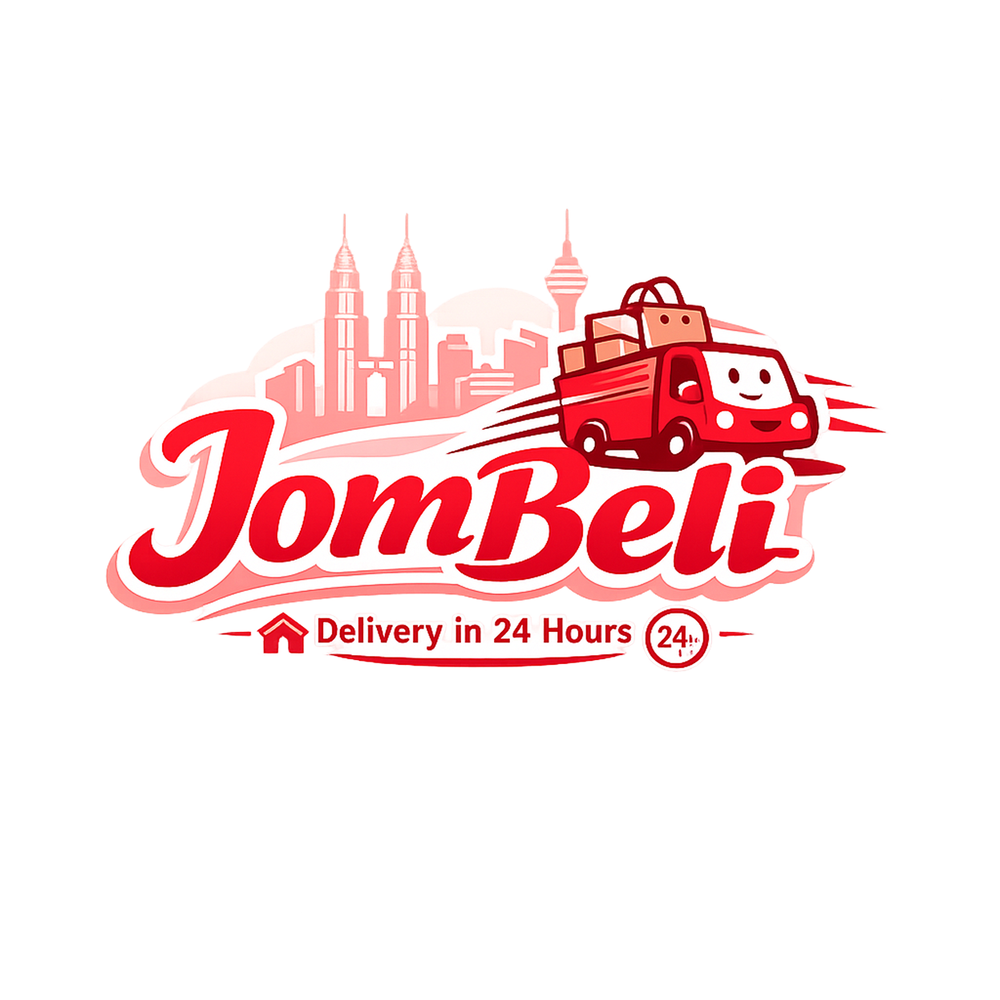

<div align="center">
  

  <h1>🛒 JomBeli</h1>
  <p><em>A one-stop e-commerce platform for buyers, sellers, couriers, and administrators in Kuala Lumpur.</em></p>

  [](https://nextjs.org/)
  [](https://react.dev/)
  [](https://supabase.com/)

</div>

---

## 📖 Overview

**JomBeli** is a full-stack e-commerce system designed to support the complete online shopping workflow, from browsing products and placing orders to seller management, courier delivery, and platform administration.

The platform includes role-based experiences for **buyers**, **sellers**, **couriers**, and **admins**, with Supabase handling authentication, database access, and user sessions.

---

## Features

| Area | Description |
|---|---|
| 🛍️ **Buyer Marketplace** | Browse products, view categories, search listings, discover offers, and shop from seller stores |
| 🛒 **Cart & Checkout** | Add items to cart, manage purchases, choose payment options, and complete orders |
| 👤 **Buyer Profile** | Manage account information, addresses, vouchers, wallet, orders, reviews, refunds, and support requests |
| 💬 **Chat & Chatbot** | Buyer and seller communication, plus chatbot support for common user questions |
| 🏪 **Seller Dashboard** | Track total products, orders, pending orders, vouchers, revenue, sales trends, and reviews |
| 📦 **Product Management** | Add, edit, list, review, and manage seller products |
| 🎟️ **Voucher Management** | Create and manage promotional vouchers for customers |
| 🚚 **Courier Dashboard** | View assigned orders, completed tasks, hub parcels, available couriers, and current delivery tasks |
| 🗺️ **Courier Navigation** | Route and delivery navigation support using map-based courier tools |
| 🛠️ **Admin Panel** | Manage users, admins, couriers, hubs, products, orders, refunds, finance, vouchers, and support tickets |
| 📊 **Reports & Analytics** | Platform charts, top-selling products, order trends, seller reports, wallet reports, and financial insights |
| 🔐 **Authentication** | Role-based login, signup, password reset, email verification, and protected routes |

---

## 🛠️ Tech Stack

- **Framework:** [Next.js](https://nextjs.org/) 16
- **Frontend:** [React](https://react.dev/) 19
- **Backend & Auth:** [Supabase](https://supabase.com/)
- **Maps:** [Leaflet](https://leafletjs.com/) + [React Leaflet](https://react-leaflet.js.org/)
- **Charts:** [Chart.js](https://www.chartjs.org/), [React Chart.js 2](https://react-chartjs-2.js.org/), and [Recharts](https://recharts.org/)
- **PDF / Reports:** jsPDF, jsPDF AutoTable, and html2pdf.js

---

## Getting Started

### Prerequisites

- Node.js `v18+`
- npm
- A configured Supabase project

### Installation

```bash
# Clone the repository
git clone https://github.com/teckann/Capstone-Project.git
cd Capstone-Project

# Install dependencies
npm install

# Start the development server
npm run dev
```

Open [http://localhost:3000](http://localhost:3000) in your browser.

### Environment Variables

Create a `.env.local` file in the project root and add your Supabase credentials:

```env
NEXT_PUBLIC_SUPABASE_URL=your_supabase_project_url
NEXT_PUBLIC_SUPABASE_ANON_KEY=your_supabase_anon_key
```

### Database Setup

The project includes a `database.sql` file that can be used to recreate the required database tables and seed data in Supabase.

---


## 📁 Project Structure

```text
Capstone-Project/
├── app/
│   ├── admin/                 # Admin dashboard and management modules
│   ├── api/                   # API routes
│   ├── auth/                  # Supabase auth callback
│   ├── buyer/                 # Buyer marketplace, cart, orders, wallet, support
│   ├── courier/               # Courier dashboard, navigation, and profile
│   ├── seller/                # Seller dashboard, products, orders, reports, vouchers
│   ├── signin/                # Sign-in page
│   ├── signup/                # Sign-up page
│   ├── forgot/                # Forgot-password flow
│   ├── resetpassword/         # Password reset page
│   ├── _components/           # Shared UI components
│   ├── _context/              # Shared React context
│   ├── _hooks/                # Custom hooks
│   ├── _lib/                  # Supabase, auth, services, routing, and utilities
│   └── _styles/               # Global styles
├── public/                    # Static assets and logos
├── database.sql               # Database schema and seed script
├── middleware.js              # Role-based route protection
└── package.json               # Dependencies and scripts
```

---

## ⚠️ Notes

- This project is intended for academic and demonstration purposes.
- Demo credentials should not be reused in a production environment.
- Supabase environment variables are required before authentication and database features will work locally.

---

## 🙏 Acknowledgements

- Supabase for authentication and database services
- Next.js and React for the application framework
- Leaflet for map and courier navigation features
- Chart.js and Recharts for platform analytics
- The JomBeli capstone team for building and refining the system

---

<div align="center">
  <p>Made by Cafe Bakers 🍞 2026</p>
</div>
